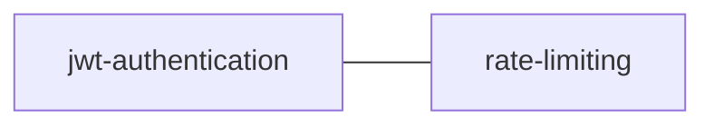

# Knowledge Base Index — Example API Project

> Auto-maintained by `/knowledge-base compile`. Do not edit manually.
> Last compiled: 2026-04-02
> Sources: 2 | Concepts: 2 | Words: ~850

## Sources

| Source | Summary |
|--------|---------|
| [auth-design](sources/auth-design.md) | JWT auth design: token flow, refresh tokens, Redis blocklist, rate limiting |
| [api-guidelines](sources/api-guidelines.md) | API conventions: auth, tiered rate limits, error format, URL versioning |

## Concepts

### Authentication & Security
- [jwt-authentication](concepts/jwt-authentication.md) — stateless JWT auth with refresh token rotation (2 sources)
- [rate-limiting](concepts/rate-limiting.md) — tiered throttling: 5/100/1000 req/min by endpoint type (2 sources)

### Uncategorized Claims
- CSRF protection via SameSite=Strict on cookies — [auth-design](sources/auth-design.md)#c-fcba1172
- Errors use standardized JSON format with code field — [api-guidelines](sources/api-guidelines.md)#c-9cecbd3d
- API versioned via URL path (/api/v1/, /api/v2/) — [api-guidelines](sources/api-guidelines.md)#c-483d4dae

## Concept Graph (Mermaid)

## Recent Queries
<!-- auto-populated by query mode -->
